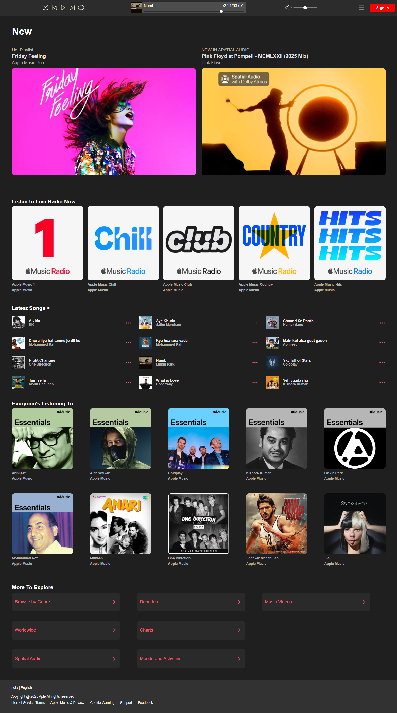
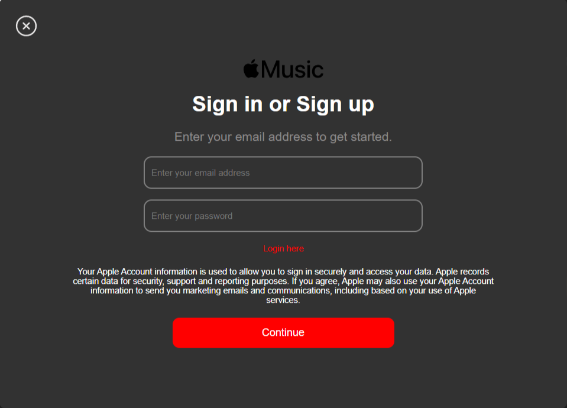

# 🎵 Apple Music Clone

This is a **full-stack clone** of Apple Music built using **HTML, CSS, JavaScript, Node.js, and MongoDB**.  
It includes music browsing, playlists, albums, and a secure login/logout system to access restricted content.

---

## 📸 Screenshots

### Main Page


### Login Portal


---

## Features
- Apple Music–style layout and design  
- Browse playlists and albums  
- Play music with basic controls (play / pause, skip, volume)  
- Login / Logout system with session-based authentication  
- Register new accounts securely (bcrypt password hashing)  
- Access to playlists & albums restricted to logged-in users  
- Dynamic rendering of content from server (JSON / DB)  

---

## Technologies Used
- HTML5  
- CSS3  
- JavaScript (Vanilla)  
- Node.js + Express  
- MongoDB + Mongoose  
- bcrypt (password hashing)  
- express-session + connect-mongo (session handling)

---

## How to Use
1. Clone this repository:
```bash
   git clone https://github.com/Vagventure/AppleMusicClone.git
   cd apple-music-clone
   ```

2. Install dependencies:
```bash
   npm install
   ```

3. Set up .env file:
```bash
   MONGO_URI=mongodb://localhost:27017/apple-music-clone
   SESSION_SECRET=yourSecretKey
   PORT=3000
   ```

4. Run the app:
```bash
   npm start
   ```

5. Open in your browser:
```bash
   http://localhost:3000
   ```
